# 🩺 CKD Ensemble Classifier

<p align="center">

  <!-- Core -->
  
  
  
  
  
  

  <!-- Activity -->
  
  
  

  <!-- Languages -->
  
  

  <!-- Community -->
  
  
  

</p>

> 🔬 A machine learning system for **Chronic Kidney Disease (CKD) prediction** using ensemble methods, based on Rahman et al., 2024 methodology. Features a FastAPI backend with 24 trained models and a React + TypeScript frontend.

🌐 **Frontend:** [ckd-ensemble-classifier.vercel.app](https://ckd-ensemble-classifier.vercel.app/) (Deployed on Vercel)
⚙️ **Backend:** Self-hosted FastAPI service

---

## 🔗 Quick Links

| Link | Description |
|------|-------------|
| 🌐 [Live Demo](https://ckd-ensemble-classifier.vercel.app/) | Frontend deployed on Vercel |
| 📖 [Documentation](#-table-of-contents) | Full project documentation |
| 🐛 [Issues](https://github.com/H0NEYP0T-466/CKD-Ensemble-Classifier/issues) | Report bugs or request features |
| 🤝 [Contributing](CONTRIBUTING.md) | How to contribute |

---

## 📑 Table of Contents

- [Features](#-features)
- [Installation](#-installation)
- [Usage](#-usage)
- [Tech Stack](#-tech-stack)
- [Dependencies & Packages](#-dependencies--packages)
- [Folder Structure](#-folder-structure)
- [Model Performance & Charts](#-model-performance--charts)
- [API Reference](#-api-reference)
- [Contributing](#-contributing)
- [License](#-license)
- [Security](#-security)
- [Code of Conduct](#-code-of-conduct)

---

## ✨ Features

- 🧠 **24 ML Models** — 3 variants × 8 ensemble models for robust CKD prediction
- 🔄 **3 Feature Selection Strategies** — All Features (24), RFE (12), Boruta (selected)
- ⚖️ **SMOTE Balancing** — Borderline-SMOTE with regular SMOTE fallback for imbalanced data
- 🌐 **REST API** — FastAPI-based prediction and training endpoints
- 📊 **Interactive Dashboard** — React + TypeScript frontend with real-time predictions
- 📈 **Rich Visualizations** — Confusion matrices, ROC curves, comparison charts
- 🔍 **MICE Imputation** — Advanced missing data handling
- 🏥 **Clinical Ready** — Based on Rahman et al., 2024 CKD research

---

## 🚀 Installation

### Prerequisites

- **Python** >= 3.10
- **Node.js** >= 18
- **npm** >= 9

### Backend Setup

```bash
# Clone the repository
git clone https://github.com/H0NEYP0T-466/CKD-Ensemble-Classifier.git
cd CKD-Ensemble-Classifier

# Create virtual environment
cd backend
python -m venv venv
source venv/bin/activate  # On Windows: venv\Scripts\activate

# Install dependencies
pip install -r requirements.txt

# Run ML pipeline (trains all 24 models)
python -m backend.ml_core.pipeline

# Start API server
python run.py
# Server runs at http://localhost:8007
```

### Frontend Setup

```bash
# From project root
npm install

# Start development server
npm run dev
# App runs at http://localhost:5173

# Build for production
npm run build
```

### Environment Variables

**Backend** (`.env`):
```env
PORT=8007
PYTHONPATH=backend
```

**Frontend** (`.env`):
```env
VITE_API_URL=http://localhost:8007
```

---

## ⚡ Usage

### 🔮 Making Predictions

**Via API:**
```bash
curl -X POST http://localhost:8007/predict/all_features \
  -H "Content-Type: application/json" \
  -d '{
    "age": 45,
    "blood_pressure": 80,
    "specific_gravity": 1.02,
    "albumin": 0,
    "sugar": 0,
    "red_blood_cells": "normal",
    "pus_cell": "normal",
    "pus_cell_clumps": "notpresent",
    "bacteria": "notpresent",
    "blood_glucose_random": 90,
    "blood_urea": 20,
    "serum_creatinine": 0.8,
    "sodium": 140,
    "potassium": 4.2,
    "hemoglobin": 14,
    "packed_cell_volume": 42,
    "white_blood_cell_count": 7500,
    "red_blood_cell_count": 5.2,
    "hypertension": "no",
    "diabetes_mellitus": "no",
    "coronary_artery_disease": "no",
    "appetite": "good",
    "pedal_edema": "no",
    "anemia": "no"
  }'
```

**Via Web UI:**
Navigate to [ckd-ensemble-classifier.vercel.app](https://ckd-ensemble-classifier.vercel.app/) → Enter patient data → Get instant CKD prediction with risk indicators.

### 🏋️ Training Models

```bash
# Trigger full training pipeline via API
curl -X POST http://localhost:8007/train
```

### 📊 Viewing Metrics

```bash
# Get evaluation metrics for all variants
curl http://localhost:8007/metrics
```

---

## 🛠 Tech Stack

### Languages


### Frameworks & Libraries


### DevOps / CI / Tools


### Cloud / Hosting


---

## 📦 Dependencies & Packages

### Runtime Dependencies

<details>
<summary><b>Python (backend/requirements.txt)</b></summary>

| Package | Version | Description |
|---------|---------|-------------|
|  | ≥1.26.0 | Numerical computing |
|  | ≥2.2.0 | Data manipulation |
|  | ≥1.4.0 | Machine learning core |
|  | ≥1.13.0 | Scientific computing |
|  | ≥0.3 | Boruta feature selection |
|  | ≥0.12.0 | SMOTE oversampling |
|  | ≥2.0.0 | Gradient boosting |
|  | ≥4.3.0 | Light GBM boosting |
|  | ≥3.8.0 | Plotting & visualization |
|  | ≥0.13.0 | Statistical visualization |
|  | ≥0.111.0 | Web framework |
|  | ≥0.29.0 | ASGI server |
|  | ≥1.4.0 | Model serialization |
|  | ≥2.7.0 | Data validation |
|  | ≥0.0.9 | Form parsing |

</details>

<details>
<summary><b>Node.js (package.json)</b></summary>

| Package | Version | Description |
|---------|---------|-------------|
|  | ^19.2.4 | UI framework |
|  | ^19.2.4 | DOM rendering |
|  | ^7.14.1 | Client-side routing |
|  | ^5.99.0 | Server state management |
|  | ^1.6.8 | HTTP client |

</details>

### Dev / Build / Test Dependencies

<details>
<summary><b>Node.js Dev Dependencies</b></summary>

| Package | Version | Description |
|---------|---------|-------------|
|  | ~6.0.2 | Type-safe JavaScript |
|  | ^8.0.4 | Build tool |
|  | ^9.39.9 | Linter |
|  | ^6.0.1 | React fast refresh |
|  | ^8.58.0 | TS ESLint rules |
|  | ^7.0.1 | React hooks linting |
|  | ^0.5.2 | React refresh linting |
|  | ^17.4.0 | Global variable definitions |
|  | ^24.12.2 | Node.js type definitions |
|  | ^19.2.14 | React type definitions |
|  | ^19.2.3 | React DOM type definitions |

</details>

---

## 📂 Folder Structure

```
CKD-Ensemble-Classifier/
├── 📁 backend/                     # FastAPI ML Backend
│   ├── 📁 api/                     # API layer
│   │   ├── main.py                 # FastAPI application
│   │   └── routers.py              # API route handlers
│   ├── 📁 ml_core/                 # ML pipeline core
│   │   ├── pipeline.py             # Main orchestrator (trains all 24 models)
│   │   ├── preprocess.py           # Data preprocessing (MICE, scaling)
│   │   ├── feature_selection.py    # RFE & Boruta feature selection
│   │   ├── train.py                # Model training (8 ensemble models)
│   │   └── evaluate.py             # Evaluation & visualization
│   ├── 📁 schemas/                 # Pydantic data models
│   │   └── models.py               # Request/response schemas
│   ├── 📁 Dataset/                 # CKD dataset files
│   ├── 📁 models/                  # Trained model serialization
│   ├── 📁 plots/                   # Generated visualizations
│   │   ├── 📁 all_features/        # Charts for all-features variant
│   │   ├── 📁 rfe/                 # Charts for RFE variant
│   │   └── 📁 boruta/              # Charts for Boruta variant
│   ├── requirements.txt            # Python dependencies
│   └── run.py                      # Server entry point
│
├── 📁 src/                         # React Frontend
│   ├── 📁 components/              # Reusable UI components
│   │   ├── FormField.tsx           # Input form field
│   │   ├── LoadingSpinner.tsx      # Loading indicator
│   │   ├── MetricsTable.tsx        # Metrics display table
│   │   ├── Navbar.tsx              # Navigation bar
│   │   └── RiskIndicator.tsx       # CKD risk visualization
│   ├── 📁 pages/                   # Page components
│   │   ├── PredictionPage.tsx      # Prediction form page
│   │   └── AnalyticsPage.tsx       # Model analytics page
│   ├── 📁 services/                # API client
│   │   └── api.ts                  # Axios API service
│   ├── 📁 types/                   # TypeScript types
│   │   └── index.ts                # Type definitions
│   ├── App.tsx                     # Root application component
│   ├── main.tsx                    # Application entry point
│   └── assets/                     # Static assets
│
├── 📁 .github/                     # GitHub configuration
│   ├── 📁 ISSUE_TEMPLATE/          # Issue form templates
│   │   ├── bug_report.yml          # Bug report form
│   │   ├── feature_request.yml     # Feature request form
│   │   └── config.yml              # Template config
│   └── pull_request_template.md    # PR template
│
├── CLAUDE.md                       # AI assistant instructions
├── package.json                    # Node.js dependencies
├── vite.config.ts                  # Vite configuration
├── eslint.config.js                # ESLint configuration
├── tsconfig.json                   # TypeScript configuration
├── LICENSE                         # MIT License
├── CONTRIBUTING.md                 # Contribution guidelines
├── SECURITY.md                     # Security policy
├── CODE_OF_CONDUCT.md              # Community standards
└── README.md                       # This file
```

---

## 📊 Model Performance & Charts

The ML pipeline generates comprehensive visualizations for each of the 3 variants (all_features, rfe, boruta):

### 📈 Comparison Charts

#### Accuracy Comparison
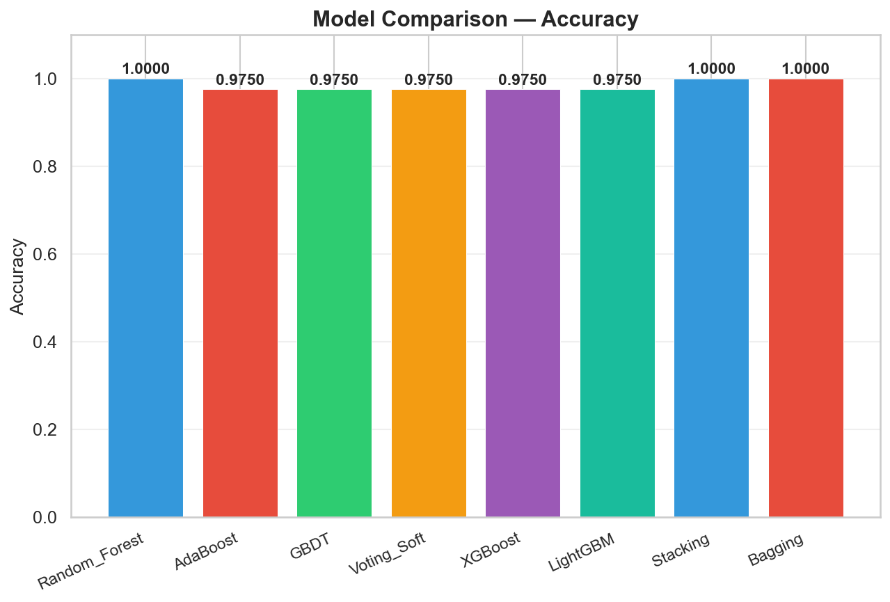

#### AUC-ROC Comparison
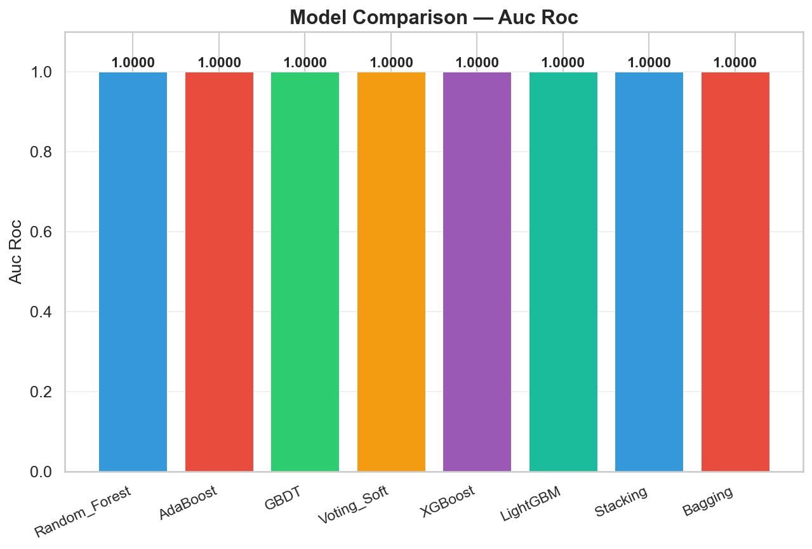

#### F1 Score Comparison


#### Precision Comparison
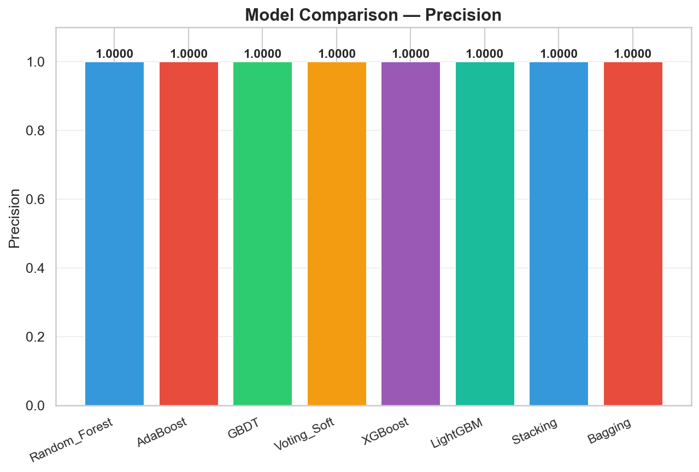

#### Recall Comparison
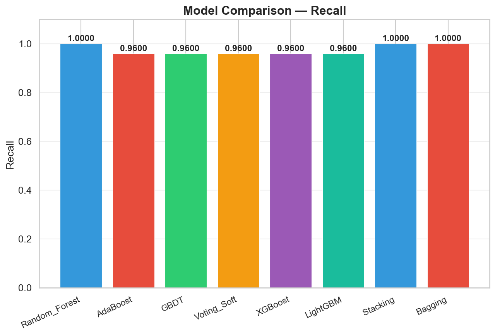

#### All Metrics Comparison
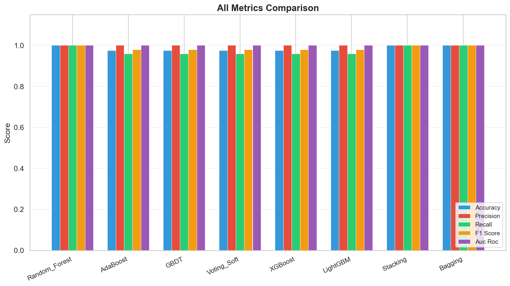

### 🔄 ROC Curves

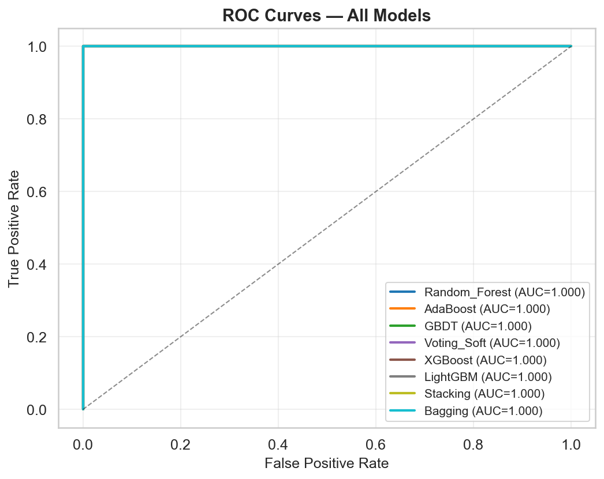

### 📉 Confusion Matrices

| Random Forest | XGBoost | LightGBM | GBDT |
|---|---|---|---|
| 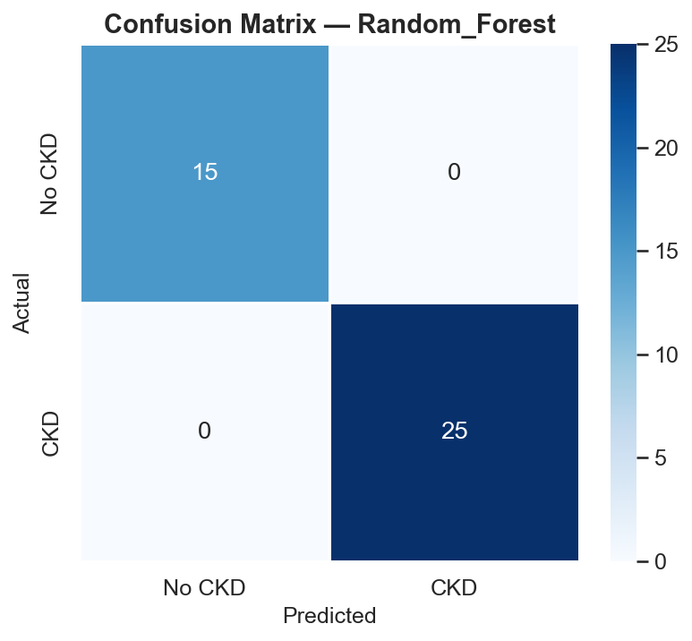 |  | 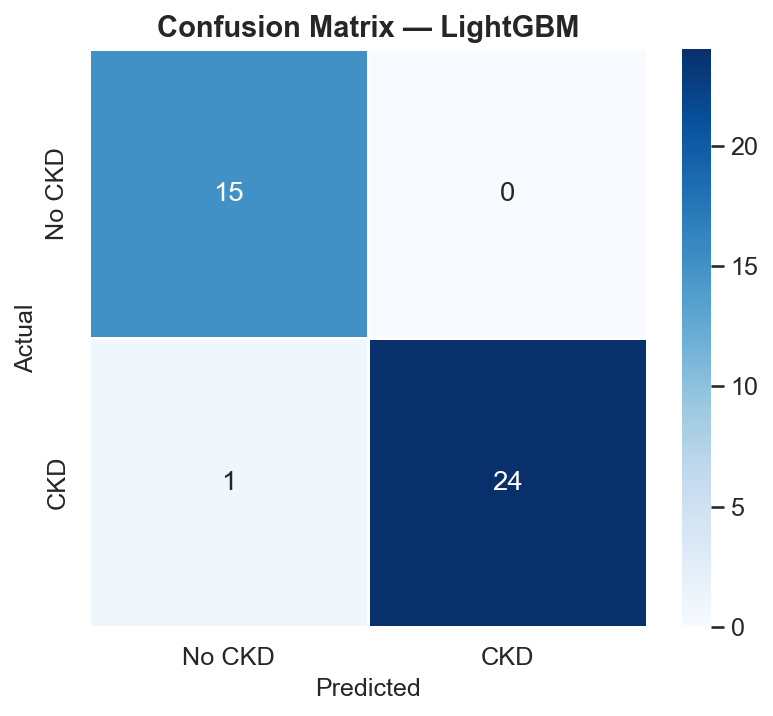 | 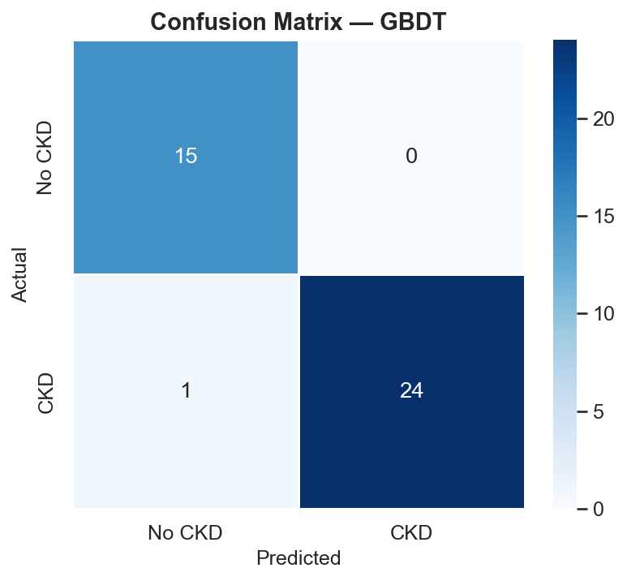 |

| AdaBoost | Bagging | Stacking | Voting Soft |
|---|---|---|---|
|  | 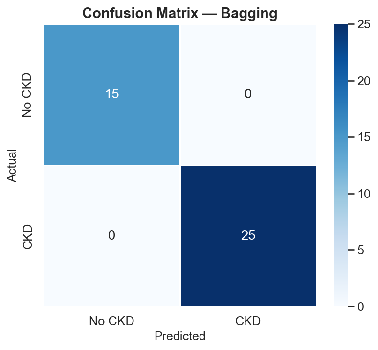 | 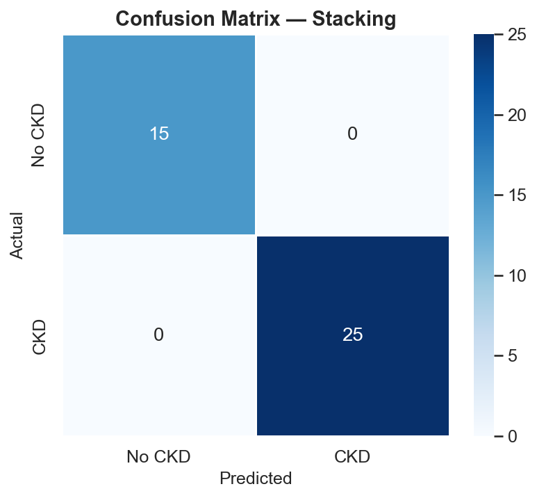 |  |

### 📊 Data Distribution

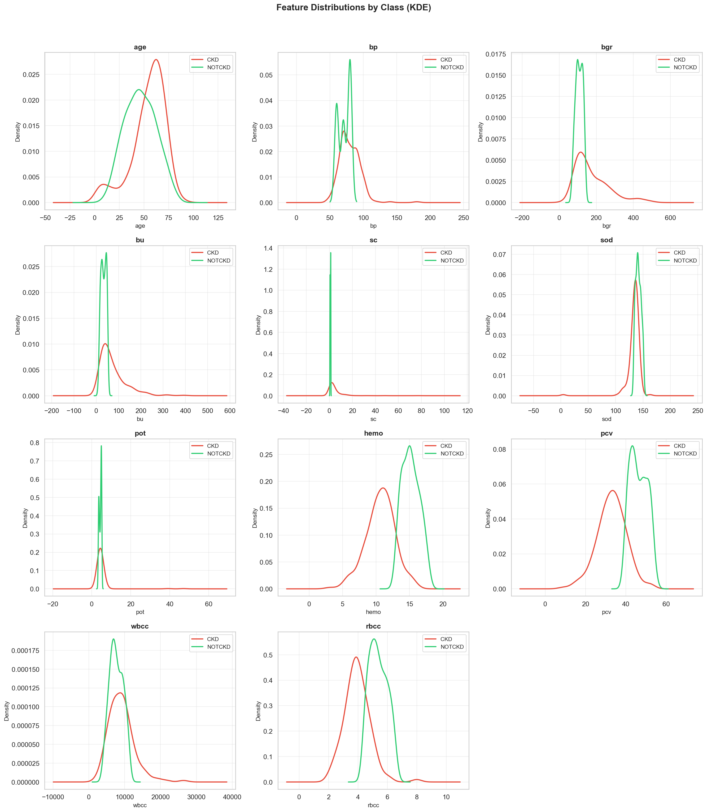

> **Note:** Similar charts are generated for all three variants (`all_features`, `rfe`, `boruta`) and stored in their respective directories under `backend/plots/`.

---

## 📡 API Reference

| Method | Endpoint | Description |
|--------|----------|-------------|
| `GET` | `/health` | Service health check |
| `POST` | `/train` | Trigger full ML pipeline training |
| `POST` | `/predict/{variant}` | Get CKD prediction (`all_features`, `rfe`, or `boruta`) |
| `GET` | `/metrics` | Get evaluation metrics for all variants |

### Prediction Request Body

```json
{
  "age": 45,
  "blood_pressure": 80,
  "specific_gravity": 1.02,
  "albumin": 0,
  "sugar": 0,
  "red_blood_cells": "normal",
  "pus_cell": "normal",
  "pus_cell_clumps": "notpresent",
  "bacteria": "notpresent",
  "blood_glucose_random": 90,
  "blood_urea": 20,
  "serum_creatinine": 0.8,
  "sodium": 140,
  "potassium": 4.2,
  "hemoglobin": 14,
  "packed_cell_volume": 42,
  "white_blood_cell_count": 7500,
  "red_blood_cell_count": 5.2,
  "hypertension": "no",
  "diabetes_mellitus": "no",
  "coronary_artery_disease": "no",
  "appetite": "good",
  "pedal_edema": "no",
  "anemia": "no"
}
```

---

## 🤝 Contributing

We welcome contributions! Please see our [Contributing Guidelines](CONTRIBUTING.md) for details on how to submit pull requests, report issues, and contribute to the project.

---

## 📜 License

This project is licensed under the [MIT License](LICENSE).

---

## 🛡 Security

Please review our [Security Policy](SECURITY.md) for information on reporting vulnerabilities and our responsible disclosure process.

---

## 📏 Code of Conduct

We are committed to providing a welcoming and inclusive experience. Please read our [Code of Conduct](CODE_OF_CONDUCT.md).

---

<p align="center">Made with ❤ by <a href="https://github.com/H0NEYP0T-466">H0NEYP0T-466</a></p>
